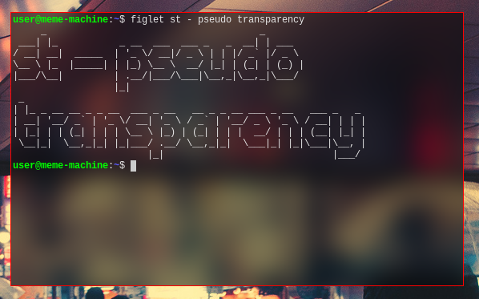

background image
================

Description
-----------

Draws a background image in place of the defaultbg color.

Notes
-----

The path to the image file has to be configured in `config.h` using the variable
`bgfile` (patch modifies `config.def.h`, changes made there need to be ported to
`config.h` if it already exists). The image format is expected to be
[farbfeld](//tools.suckless.org/farbfeld). In case the background image 
is smaller than the window size the background will be tiled.

Pseudo Transparency
-------------------

The variable `pseudotransparency` enables functionality which fixes the 
coordinates of the background image to the screen origin. This emulates the 
effect of transparency without the need for an *X composite manager*.

*Hint*: With the use of [farbfeld utilities](http://zzo38computer.org/fossil/farbfeld.ui/) 
effects can be applied to the desktop background in an automated fashion. 
Pictured below is an example of the result of a darken and blur operation 
invoked with the following command:

	jpg2ff < wallpaper.jpg | ff-border e 50 | ff-bright rgba 0 0.5 1 | ff-blur 50 15 > st_wallpaper.ff

Download
--------

* [st-background-image-0.8.4.diff](st-background-image-0.8.4.diff)
* [st-background-image-0.8.5.diff](st-background-image-0.8.5.diff)

Signal Reloading
----------------

Apply the following patch on top of the previous to enable reloading the
background image when a USR1 signal occurs:

* [st-background-image-signal-reload-0.8.5.diff](st-background-image-signal-reload-0.8.5.diff)

If you use the [xresources with signal reloading](//st.suckless.org/patches/xresources-with-reload-signal)
patch ignore the patch above and simply add these two lines to the beginning of
the `reload` function located in the file `x.c`:

	XFreeGC(xw.dpy, xw.bggc);
	bginit();

*Hint*: You can send a USR1 signal to all st processes with the following
command:

	pidof st | xargs kill -s USR1

Authors
-------
* Matthias Schoth - <mschoth@gmail.com>

