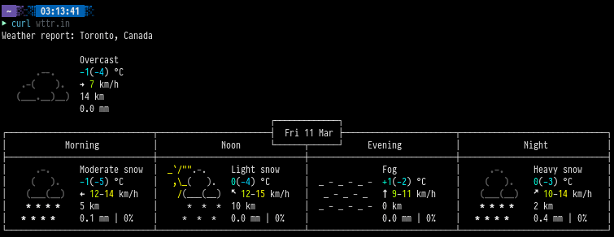

charoffsets
===========

Description
-----------
Some fonts seem to misreport their height, which leads to unsightly vertical
gaps appearing between rows of text with characters that are supposed to fill
the vertical space, like box-drawing characters.

This is because the character height that st uses is off from the actual glyph
height, so there's a gap of bg space above and below each glyph. This can be
adjusted by modifying the `chscale` value, but reducing that value alone just
clips the bottom of the glyphs.

This patch simply adds a `cyoffset` value (and a corresponding `cxoffset`) to
allow you to adjust the glyph position, so it doesn't get clipped short when
you reduce the `chscale`. You'll have to play with the values to get it to
look right with your font choice.

Example
-------
Note the vertical gaps between the lines in the box art, and the raised part
that sticks out on the time display.

Taken with Pragmata Pro with a few font patches applied.

Download
--------
* [st-charoffsets-20220311-0.8.5.diff](st-charoffsets-20220311-0.8.5.diff)

Authors
-------
* Zacchary Dempsey-Plante - <zacc@ztdp.ca>
