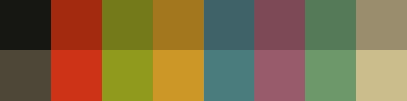

# june scheme

## Description

Color scheme created by June on [causal.agency](https://causal.agency)



## Colors

```
/* Terminal colors (16 first used in escape sequence) */
static const char *colorname[] = {
	/* 8 normal colors */
	[0] = "#161510", /* black */
	[1] = "#a32810", /* red     */
	[2] = "#727a18", /* green   */
	[3] = "#a37720", /* yellow  */
	[4] = "#3d6266", /* blue    */
	[5] = "#7a4955", /* magenta */
	[6] = "#557a55", /* cyan    */
	[7] = "#998d6b", /* white   */

	/* 8 bright colors */
	[8]  = "#4c4635", /* black   */
	[9]  = "#cc3214", /* red     */
	[10] = "#8e991e", /* green   */
	[11] = "#cc9528", /* yellow  */
	[12] = "#4c7b7f", /* blue    */
	[13] = "#995b6b", /* magenta */
	[14] = "#6b996b", /* cyan    */
	[15] = "#ccbc8e", /* white   */

	[255] = 0,
	[256] = "#14130e",
	[257] = "#b7a980",
	[258] = "#7a7155",
	[259] = "#a34110"
};

/*
 * Default colors (colorname index)
 * foreground, background, cursor, reverse cursor
 */
unsigned int defaultfg = 257;
unsigned int defaultbg = 256;
unsigned int defaultcs = 258;
static unsigned int defaultrcs = 259;
```
