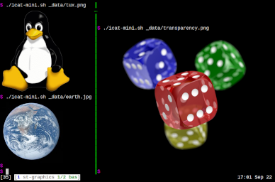

Kitty Graphics Protocol
=======================

Description
-----------
This patch implements a subset of the [kitty graphics
protocol](https://sw.kovidgoyal.net/kitty/graphics-protocol)
in st. For more details, refer to the [st-graphics
repository](https://github.com/sergei-grechanik/st-graphics).

Notes
-----
* Additional dependencies: imlib2, zlib
* You can configure various limits, such as the maximum image size and cache
  size, in `config.h`.
* There are several additional shortcuts:
  - `Ctrl+Shift+RightClick` to preview the clicked image in feh.
  - `Ctrl+Shift+MiddleClick` to view debug information (image id, placement id,
    etc).
  - `Ctrl+Shift+F1` to toggle graphics debug mode. It has three states: 1) no
    debugging; 2) show general info and print logs to stderr; 3) print logs and
    show bounding boxes.
  - `Ctrl+Shift+F6` to dump the state of all images to stderr.
  - `Ctrl+Shift+F7` to unload all images from RAM (the cache in `/tmp` will be
    preserved).
  - `Ctrl+Shift+F8` to toggle image display.
* This patch includes support for some XTWINOPS control sequences to query
  information that is sometimes required for image display.
* This patch includes support for underline colors and styles. It also
  changes the behavior of underlines by increasing their thickness with font
  size. If you don't like it, apply the following diff:

	diff --git a/x.c b/x.c
	index e0925c4..cd86fdf 100644
	--- a/x.c
	+++ b/x.c
	@@ -1691,3 +1691,3 @@ xdrawglyphfontspecs(const XftGlyphFontSpec *specs, Glyph base, int len, int x, i
	        /* Integer thickness in pixels. Must not be 0. */
	-       int thick = MAX(1, roundf(fthick));
	+       int thick = 1;
	        /* The default gap between the baseline and a single underline. */

Patch Compatibility
-------------------
* This patch already includes the anysize patch. If you prefer the expected
  behavior, set `anysize_halign` and `anysize_valign` to 0 in `config.h`.
* This patch already supports underline colors and styles, so it is incompatible
  with the undercurl patch.
* It should be compatible with the boxdraw, scrollback, alpha, and background
  image patches, with minor conflict resolution. Ligatures also seem to work
  after some hacking. For more details, see
  [here](https://github.com/sergei-grechanik/st-graphics?tab=readme-ov-file#patch-compatibility).

Download
--------
* [st-kitty-graphics-20240922-a0274bc.diff](st-kitty-graphics-20240922-a0274bc.diff)

Author
------
* Sergei Grechanik <sergei.grechanik@gmail.com>
