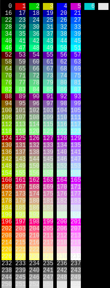
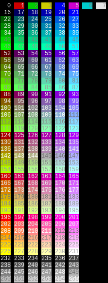

# Minimum Contrast

A patch that enforces a minimum contrast ratio.

## Description

Apply the patch and set the `min_contrast_ratio` in `config.h` and the 
terminal will attempt to enforce this contrast ratio by increasing or 
decreasing the brightness of the foreground color when needed.

This is useful when your chosen theme clashes with another program to produce unreadable text.

You can see the effect with these two bash one liners.


```
for i in {0..255}; do printf "\e[30m\e[48;5;%sm%3d\e[0m " "$i" "$i"; if (( i == 15 )) || (( i > 15 )) && (( (i-15) % 6 == 0 )); then echo; fi; done
```

```
for i in {0..255}; do printf "\e[48;5;%sm%3d\e[0m " "$i" "$i"; if (( i == 15 )) || (( i > 15 )) && (( (i-15) % 6 == 0 )); then echo; fi; done
```

### Before and After

 

## Download


[st-minimumcontrast-20241029-0.9.2.diff](st-minimumcontrast-20241029-0.9.2.diff)


## Author

Nick Lott - <nick.lott@gmail.com>
