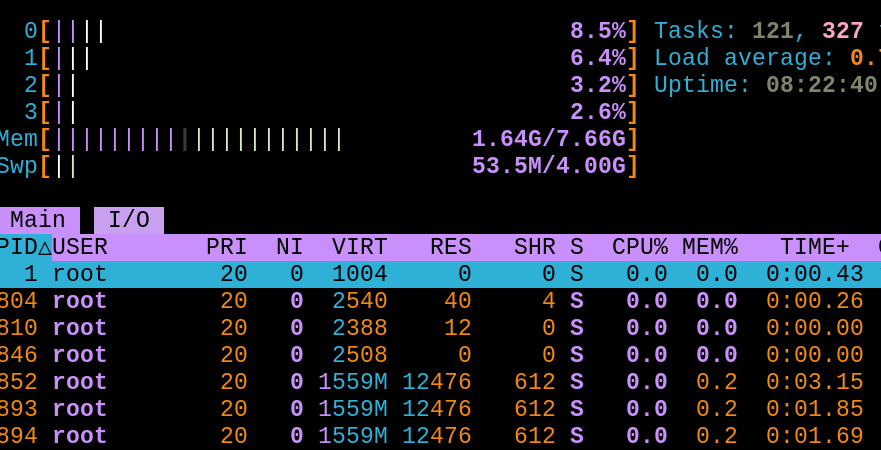

sunset
======

Description
-----------

The "Sunset" palette consists of three vibrant color schemes—Aurant,
Saffron, and Tangerine—designed for clear visual distinctions in terminal
outputs such as errors, warnings, and informational messages. The mix of
dark and bright colors ensures excellent readability and usability across
various terminal applications, with custom colors adding flexibility for
UI elements.

Notes
-----

Once applied, the terminal colors are changed, and applications such as
tmux or vim will use the new color scheme as well.

The font used in the screenshots is Liberation Mono.

Example
-------

Aurant

Saffron

Tangerine

Download
--------

* [st-sunset-aurant-20240627-db6a481.diff](st-sunset-aurant-20240627-db6a481.diff)
* [st-sunset-saffron-20240628-792ab7a.diff](st-sunset-saffron-20240628-792ab7a.diff)
* [st-sunset-tangerine-20240628-dae63ed.diff](st-sunset-tangerine-20240628-dae63ed.diff)

Authors
-------

* El Bachir - <bachiralfa@gmail.com>
